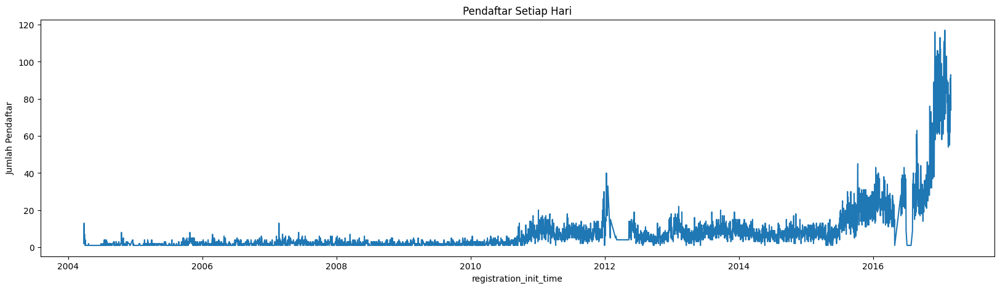

# Laporan Proyek Machine Learning - Daffa Muhamad Azhar

# KKBox's Music Recommendation

KKBOX merupakah sebuah platform untuk streaming musik yang berbasis di Taiwan. Pada platform ini, kita harus berlangganan terlebih dahulu untuk dapat menggunakan seluruh fitur dan layanannya. Platform ini menyediakan akses ke jutaan lagu dari berbagai genre dan artis dari seluruh dunia, termasuk lagu - lagu lokal dari Taiwan, Hong Kong, dan negara - negara Asia lainnya. Aplikasi ini dapat digunakan diberbagai perangkat seperti desktop, web, dan mobile untuk pengguna iOS dan Android.

## Business Understanding

Beberapa tahun lalu, tidak terbayangkan bahwa seseorang yang sama akan mendengarkan lagu The Beatles, Vivaldi, dan Lady Gaga pada perjalanan pagi mereka melalui radio. Tetapi, masa kejayaan radio telah berlalu, dan **Musical Gatekeeper** telah berganti dengan sebuah algoritma dan layanan streaming musik yang tanpa batas.

Dengan pendengar yang mendengarkan seluruh genre dan jenis musik, algoritma akan kesulitan dalam beberapa area utama. Dengan tidak cukupnya data histori, bagaimana algoritma dapat mengetahui jika pendengar akan menyukai lagu baru atau artis yang baru? Dan bagaimana caranya untuk mengetahui lagu apa yang harus direkomendasikan kepada pendengar yang baru?

Dengan permasalahan yang muncul tersebut, pembuatan sistem rekomendasi musik menggunakan machine learning merupakan sebuah solusi. Dengan sistem rekomendasi ini, baik pengguna baru ataupun pengguna yang mendengarkan seluruh jenis musik akan mendapatkan lagu rekomendasi yang lebih akurat dibandingkan dengan algoritma biasa. Model akan melakukan prediksi probabilitas dari user untuk mendengarkan lagu secara berulang setelah pendengaran pertama dalam beberapa waktu.

Algoritma yang dapat digunakan adalah Gradient Boosting. Untuk permasalahan kali ini menggunakan pengembangan dari Gradient Boosting yaitu XGBoost dan LGBM. Metric utama dari model tersebut adalah ROC AUC.

## Data Understanding

Dataset dapat diunduh pada tautan : [WSDM - KKBox's Music Recommendation](https://www.kaggle.com/competitions/kkbox-music-recommendation-challenge/data)

Pada dataset tersebut tidak gunakan seluruhnya. Dataset yang digunakan antara lain : 

- train.csv
Atribut:
 - msno: user id
 - song_id: song id
 - source_system_tab: the name of the tab where the event was triggered. System tabs are used to categorize KKBOX mobile apps functions. For example, tab my library contains functions to manipulate the local storage, and tab search contains functions relating to search.
 - source_screen_name: name of the layout a user sees.
 - source_type: an entry point a user first plays music on mobile apps. An entry point could be album, online-playlist, song .. etc.
 - target: this is the target variable. target=1 means there are recurring listening event(s) triggered within a month after the user’s very first observable listening event, target=0 otherwise.

- members.csv
Atribut:
 - msno
 - city
 - bd: age. Note: this column has outlier values, please use your judgement.
 - gender
 - registered_via: registration method
 - registration_init_time: format %Y%m%d
 - expiration_date: format %Y%m%d

- songs.csv
Atribut:
 - song_id
 - song_length: in ms
 - genre_ids: genre category. Some songs have multiple genres and they are separated by `|`
 - artist_name
 - composer
 - lyricist
 - language

***Data yang digunakan pada data train hanya 45%.***

### Train

Data train merupakan data utama untuk melakukan pelatihan model. Pada data train, terdapat target untuk diprediksi dengan fitur - fitur yang mendukungnya.

Perbandingan target pada data train


Dapat dilihat dari piechart tersebut bahwa perbandingan target setara sehingga data tersebut balance.

Kemudian lihat pengaruh setiap fitur terhadap target


dilihat dari grafik tersebut, pengguna local-library dan local-playlist yang akan mendengar kembali lagu yang pernah diputar.


dilihat dari grafik tersebut, my library merupakan source system yang paling banyak membuat member untuk mendengarkan kembali lagu yang pernah diputar.


dan local playlist dan my libary merupakan source screen yang paling banyak membuat member untuk mendengarkan kembali lagu.

### Members

Pada data member, terdapat rincian data dari setiap member. 


Dari persebaran umur diatas, terdapat outlier dari umur member.


dari piechart persentase gender, terdapat 57.8% dimana member tidak memiliki gender dalam arti member tidak menginputkan gendernya.

Berikut persebaran kota dari member


Persebaran Pendaftaran


Berikut merupakan grafik jumlah pendaftar setiap hari maupun bulan




### Songs

Pada data songs, terdapat rincian dari setiap lagu yang terdapat pada data train.

Berikut meupakan TOP-10 Genre yang ada pada data train


Dan bahasa yang paling banyak digunakan pada lagu pada data train


## Data Preparation

Ketiga dataset tersebut digabungkan dengan inner join sehingga setiap member memiliki fitur tambahan yang didapat dari data member dan setiap lagu memiliki fitur tambahan yang didapat dari data song. 

Dataset memiliki banyak nilai `NULL` sehingga data tersebut harus dibersihkan. Pembersihan data tersebut dapat dilakukan dengan drop maupun imputing. Pada kasus ini data yang `NULL` akan diisi dengan nilai baru yaitu `UNKNOWN` untuk tipe data kategori dan nilai 0 untuk tipe data numerikal. Dataset ini juga memiliki anomali seperti umur pada member. Hal tersebut dapat ditangani dengan merubah umur tersebut dengan rata - rata umur member. 

Pada kasus kali ini tidak dilakukan One Hot Encoding karena akan membuat dataset menjadi sangat besar hingga tidak tertampung lagi. Agar dapat melakukan pelatihan, data yang bertipe `object` akan dikonversi kenjadi `category`.

Hasil akhir dari data preparation ini yaitu gabungan ketiga dataset yang telah dibersihkan dengan total 3.319.838 data dan 22 fitur.

## Modeling

Sebelum melakukan pelatihan model, dataset akan di-split sebesar 70% untuk data latih dan 30% untuk data tes.

Model yang dilatih adalah:
- XGBoost
 - Merupakan pengembangan dari Gradient Boosting
 - Cocok untuk dataset yang kompleks karena opsi hyperparameter yang banyak.

- LGBM (Light Gradient-Boosting Machine)
 - Cocok untuk dataset yang besar karena penggunaan teknik histogram-based splitting.
 - Waktu training lebih cepat karena adanya teknik pengoptimalan.

XGBoost merupakan model hasil dari pengembangan dan pengoptimalan dari Gradient Boosting. Model ini merupakan ensemble model untuk meningkatkan kinerja model. Cara kerja XGBoost adalah dengan memperbaiki model secara bertahap dengan menambahkan model baru yang disebut "weak learner". Setiap model baru (weak learner) berusaha untuk memperbaiki kesalahan prediksi yang dilakukan oleh model sebelumnya. Model ini menggunakan teknik logistic regression untuk memprediksi nilai probabilitas target. 

Sementara LGBM merupakan model hasil dari pengembangan dan pengoptimalan Gradient Boosting juga. Berbeda dengan XGBoost, LGBM memiliki beberapa teknik optimasi unik yang memungkinkannya untuk melakukan pelatihan model dengan lebih cepat dan akurat, terutama untuk dataset dengan dimensi yang tinggi dan jumlah sample yang besar. LGBM menggunakan teknik "leaf-wise" untuk memilih fitur dan "histogram-based" untuk membangun histogram fitur. Metode ini memungkinkan LGBM untuk menghindari proses pengurutan (sorting) data yang memakan waktu, sehingga menghemat waktu pemrosesan dan memungkinkan model untuk bekerja pada dataset yang lebih besar.Selain itu, LGBM juga mendukung teknik pengoptimalan seperti regularization, boosting, dan pruning. Pengoptimalan ini membantu model menghindari overfitting dan meningkatkan akurasi prediksi.

parameter yang digunakan untuk kedua model pada kasus ini:
```py
XGBClassifier(
    'objective': 'binary:logistic',
    'eval_metric': 'auc',
    'max_depth': 15,
    'learning_rate': 0.001,
    'subsample': 0.8,
    'colsample_bytree': 0.8,
    'gamma': 1,
    'min_child_weight': 1,
    'reg_alpha': 0,
    'reg_lambda': 1
)
```

```py
LGBMClassifier(
    'objective': 'binary',
    'boosting': 'gbdt',
    'learning_rate': 0.001 ,
    'verbose': 0,
    'num_leaves': 2**8,
    'bagging_fraction': 0.95,
    'bagging_freq': 1,
    'bagging_seed': 1,
    'feature_fraction': 0.9,
    'feature_fraction_seed': 1,
    'max_bin': 256,
    'num_rounds': 80,
    'metric' : 'auc'
)
```

## Evaluasi

Metric yang digunakan untuk evaluasi model adalah ***ROC AUC***.

ROC AUC merupakan metric evaluasi yang cocok untuk dataset yang imbalance karena metric ini mengukur kemampuan model dalam membedakan target 0 dan 1, tidak akan terpengaruh dengan perbandingan jumlah sempel pada masing - masing target. Metric ini juga menunjukkan seberapa baik model dalam membedakan target pada tingkat threshold yang berbeda.

Mencari treshold terbaik juga merupakan salah satu cara untuk memperoleh perfoma terbaik dari model.

Selain ROC AUC, confusion matrix juga digunakan terutama akurasi.

Hasil dari Evaluasi Model :
- XGBoost
 - ROC AUC Score : 0.6586
 - Akurasi : 0.6592
 - Recall : 0.6586
 - Presisi : 0.6621
 - F1 Score : 0.6838


- LGBM
 - ROC AUC Score : 0.6420
 - Akurasi : 0.6422
 - Recall : 0.6420
 - Presisi : 0.6424
 - F1 Score : 0.6530


Dilihat dari hasil evaluasi, Performa XGBoost lebih baik dari LGBM dalam kasus ini. Sehingga disarankan menggunakan Model XGBoost.